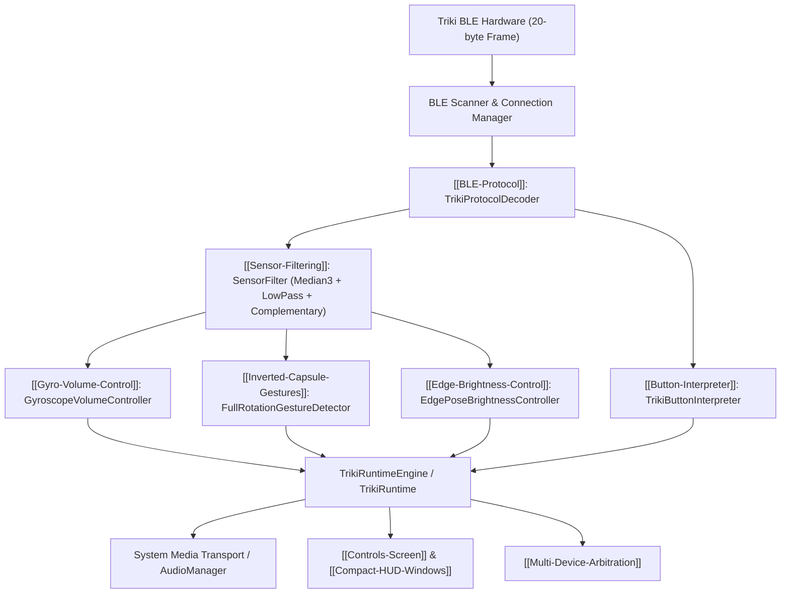

---
title: Całościowy Przegląd Architektury Systemu
tags:
  - architecture
---

# Całościowy Przegląd Architektury Systemu

Projekt **Triki Music Controller** łączy fizyczny kontroler Triki (wyposażony w 6-osiowe IMU i przycisk fizyczny) z dwoma niezależnymi platformami klienckimi:
- [[Windows-Architecture]] — aplikacja dla Windows 11 napisana w .NET 10 i WinUI 3.
- [[Android-Architecture]] — aplikacja mobilna dla Androida napisana w Kotlin i Jetpack Compose.

Powiązane węzły:
- [[BLE-Protocol]] — warstwa transportowa Bluetooth Low Energy.
- [[Sensor-Filtering]] — wstępne przetwarzanie i filtracja sygnałów IMU.
- [[Settings-Architecture]] — model konfiguracji i synchronizacji stanu.
- [[ADR-002-Dual-Platform-Core-Parity]] — zasada 100% spójności algorytmów między platformami.

---

## Przepływ Danych (Pipeline)

---

## Podział na Warstwy

1. **Warstwa Domain**:
   - Zawiera niemutowalne rekordy stanu: `TrikiSensorData`, `FilteredSensorData`, `OrientationData`, `MediaSnapshot`, `RuntimeSnapshot`.
   - Czyste reguły bez zależności od bibliotek graficznych czy platformowych systemów operacyjnych.

2. **Warstwa Core**:
   - Deterministyczne algorytmy matematyczne i przetwarzanie sygnałów.
   - Identyczna implementacja w C# (.NET 10) i Kotlinie (Android JVM), w 100% testowalna jednostkowo bez emulatorów i fizycznego sprzętu.

3. **Warstwa Services / Gateway**:
   - Integracja z interfejsami API systemu operacyjnego (`Windows.Media.Control`, `Android.MediaSessionManager`, `SystemBrightnessService`).

4. **Warstwa Prezentacji (UI)**:
   - Reaktywne modele widoku (`MainViewModel`) wystawiające wyłącznie `StateFlow` / `INotifyPropertyChanged`.
   - Brak jakiejkolwiek logiki biznesowej w widokach XAML / Composable.
