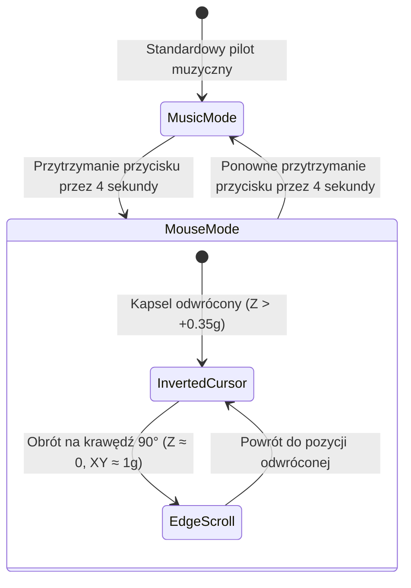

---
title: Tryb Myszki Żyroskopowej (Air Mouse)
tags:
  - core
  - mouse
  - imu
---

# Tryb Myszki Żyroskopowej (Air Mouse)

Tryb **Air Mouse** pozwala przekształcić kontroler Triki w bezprzewodowy wskaźnik i mysz komputerową ze sterowaniem kursorem w powietrzu, lewym/prawym przyciskiem myszy oraz przewijaniem stron (scroll).

Powiązane węzły:
- [[Button-Interpreter]] — detekcja 4-sekundowego przytrzymania przycisku i konsumpcja hold.
- [[Compact-HUD-Windows]] — powiadomienia OSD o włączeniu/wyłączeniu trybu myszki.
- [[Controls-Screen]] — status trybu myszki w zakładce Sterowanie.
- [[System-Overview]] — architektura systemu.

---

## Zasada Działania i Interakcji

### 1. Włączanie / Wyłączanie (Przytrzymanie 4 sekundy)
- Przytrzymanie fizycznego przycisku przez **4.0 sekundy** (4000 ms) przełącza tryb myszki.
- Wyzwolenie jest potwierdzane dźwiękiem oraz komunikatem w Windows Compact HUD (*„Tryb myszki: Aktywny”*).
- Puszczenie przycisku po 4 sekundach jest automatycznie pochłaniane (`ConsumeCurrentHold`) — nie wywołuje kliknięcia myszy ani pauzy muzyki.

### 2. Sterowanie Kursorem w Powietrzu (Pozycja odwrócona)
- Gdy kapsel znajduje się w pozycji odwróconej ($a_z \ge +0.35g$), odczyty żyroskopu (Pitch / Yaw) są przeliczane na ruch kursora myszy $\Delta X, \Delta Y$ za pomocą natywnego Windows API `SendInput`.
- Zastosowano filtr wygładzający oraz nieliniową balistykę przyspieszenia:
  $$v = \text{sign}(\omega) \cdot (|\omega| \cdot 0.38 + |\omega|^2 \cdot 0.006)$$
- Drobne ruchy dłoni pozwalają na pikselową precyzję, a szybsze ruchy pozwalają błyskawicznie przebyć cały ekran.

### 3. Przyciski Myszy
- **1x Kliknięcie** -> Lewy Przycisk Myszy (LPM).
- **2x Kliknięcie** / **3x Kliknięcie** -> Prawy Przycisk Myszy (PPM / Menu kontekstowe).

### 4. Kółko Przewijania (Scroll w pozycji 90°)
- Po obróceniu kontrolera na krawędź ($90^\circ$), moduł przełącza się w tryb scrolla:
  - Obrót w prawo (zgodnie z ruchem wskazówek zegara) przewija dokument / stronę w dół (`ScrollDelta < 0`).
  - Obrót w lewo (przeciwnie do wskazówek zegara) przewija w górę (`ScrollDelta > 0`).
  - Czułość: $10^\circ$ obrotu = 1 krok scrolla (`WHEEL_DELTA = 120`).
