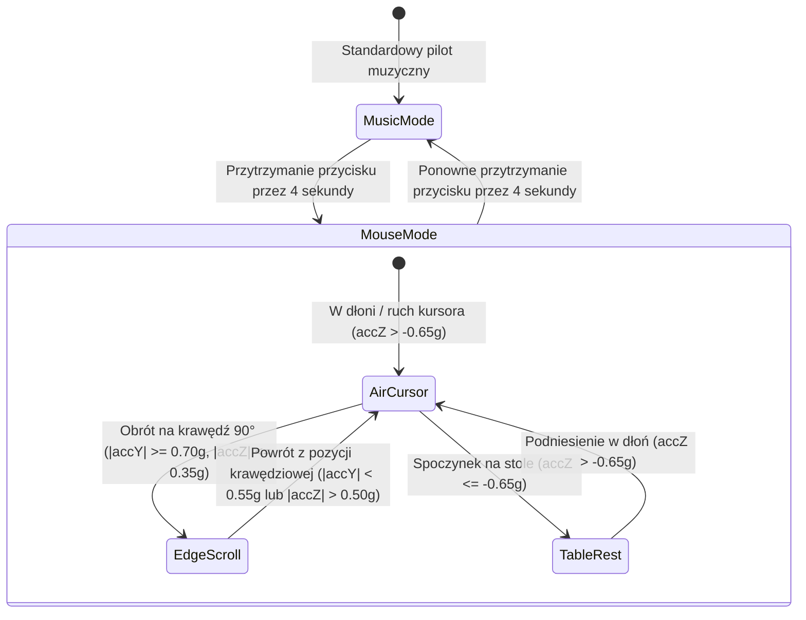

# Tryb Myszki Żyroskopowej (Air Mouse)

Tryb **Air Mouse** pozwala przekształcić kontroler Triki w bezprzewodowy wskaźnik i mysz komputerową ze sterowaniem kursorem w powietrzu, lewym/prawym przyciskiem myszy oraz przewijaniem stron (scroll).

Powiązane węzły:
- [[Button-Interpreter]] — detekcja 4-sekundowego przytrzymania przycisku i konsumpcja hold.
- [[Compact-HUD-Windows]] — powiadomienia OSD o włączeniu/wyłączeniu trybu myszki.
- [[Controls-Screen]] — status trybu myszki w zakładce Sterowanie.
- [[Windows-Architecture]] — integracja z platformą Windows (SendInput, GSMTC).
- [[System-Overview]] — architektura systemu.
- [[Release-v3.1.0]] — wprowadzenie trybu myszki żyroskopowej.
- [[Release-v3.1.2]] — pełny pionowy zakres ruchu kursora (accZ > -0.65g).

---

## Zasada Działania i Interakcji

### 1. Włączanie / Wyłączanie (Przytrzymanie 4 sekundy)
- Przytrzymanie fizycznego przycisku przez **4.0 sekundy** (4000 ms) przełącza tryb myszki.
- Wyzwolenie jest potwierdzane dźwiękiem oraz komunikatem w Windows Compact HUD (*„Tryb myszki: Aktywny”*).
- Puszczenie przycisku po 4 sekundach jest automatycznie pochłaniane (`ConsumeCurrentHold`) — nie wywołuje kliknięcia myszy ani pauzy muzyki.

### 2. Sterowanie Kursorem w Powietrzu
- Gdy kontroler jest trzymany w dłoni w pełnym pionowym zakresie ($a_z > -0.65g$), odczyty żyroskopu (Pitch / Yaw) są przeliczane na ruch kursora myszy $\Delta X, \Delta Y$ za pomocą natywnego Windows API `SendInput`.
- **Detekcja spoczynku na stole**: Gdy urządzenie leży płasko na biurku ($a_z \le -0.65g$), ruch kursora jest całkowicie zamrażany (`TableRestMaxZ = -0.65g`).
- **Sub-pikselowy akumulator ułamkowy**: Zapobiega utracie powolnych mikroruchów, zapewniając płynność 1:1 przy precyzyjnym celowaniu.
- **Tłumienie drgań kliknięcia (Click-Jitter Suppression)**: W momencie wciśnięcia przycisku ruch kursora jest stabilizowany przez 90 ms (`ClickSuppressionDurationNanos = 90_000_000`), eliminując przypadkowe zerwanie celownika pod wpływem mechanicznego nacisku palca.
- **Adaptacyjny filtr EMA**: Dynamicznie przełącza się z mocnego filtrowania drżenia dłoni przy wolnym ruchu ($\alpha \approx 0.50$) na natychmiastową reakcję przy szybkim zamachu ($\alpha \approx 0.85$).
- **Nieliniowa balistyka prędkościowa**:
  $$v = \text{sign}(\omega) \cdot (|\omega_{\text{soft}}| \cdot 0.20 + |\omega_{\text{soft}}|^2 \cdot 0.0030)$$
- **Ergonomiczne dopasowanie osi pionowej**: $1.15\times$ mnożnik skali dla osi Pitch, odpowiadający naturalnemu zakresowi ruchu nadgarstka.

### 3. Przyciski Myszy
- **1x Kliknięcie** -> Lewy Przycisk Myszy (LPM).
- **2x Kliknięcie** / **3x Kliknięcie** -> Prawy Przycisk Myszy (PPM / Menu kontekstowe).

### 4. Kółko Przewijania (Scroll na bocznej krawędzi 90°)
- Po obróceniu kontrolera na boczną krawędź ($|a_y| \ge 0.70g, |a_z| \le 0.35g$), moduł przełącza się w tryb scrolla (z histerezą wyjścia: $|a_y| < 0.55g$ lub $|a_z| > 0.50g$):
  - Obrót w prawo (zgodnie z ruchem wskazówek zegara) przewija dokument / stronę w dół (`ScrollDelta < 0`).
  - Obrót w lewo (przeciwnie do wskazówek zegara) przewija w górę (`ScrollDelta > 0`).
  - Czułość: $8^\circ$ obrotu = 1 krok scrolla (`WHEEL_DELTA = 120`).
