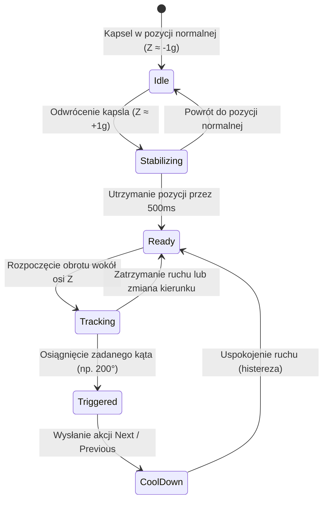

---
title: Gesty Odwróconego Kapsla (Zmiana Utworu)
tags:
  - core
  - gesture
---

# Gesty Odwróconego Kapsla (Zmiana Utworu)

Moduł `FullRotationGestureDetector` odpowiada za przełączanie utworów (Następny / Poprzedni) po odwróceniu kapsla do góry dnem ($180^\circ$).

Powiązane węzły:
- [[Controls-Screen]] — konfiguracja docelowego kąta obrotu ($90^\circ–360^\circ$).
- [[Compact-HUD-Windows]] — popup zmiany utworu z okładką albumu.
- [[Sensor-Filtering]] — detekcja wektora grawitacji.

---

## Logika Wykrywania Gestu

- **Ruch dłoni w lewo (przeciwnie do wskazówek zegara)** -> Akcja `Next` (Następny utwór).
- **Ruch dłoni w prawo (zgodnie ze wskazówkami zegara)** -> Akcja `Previous` (Poprzedni utwór).
- **Konfigurowalny Kąt Docelowy**: Użytkownik może ustawić czułość w zakresie $90^\circ–360^\circ$ (domyślnie $200^\circ$).
